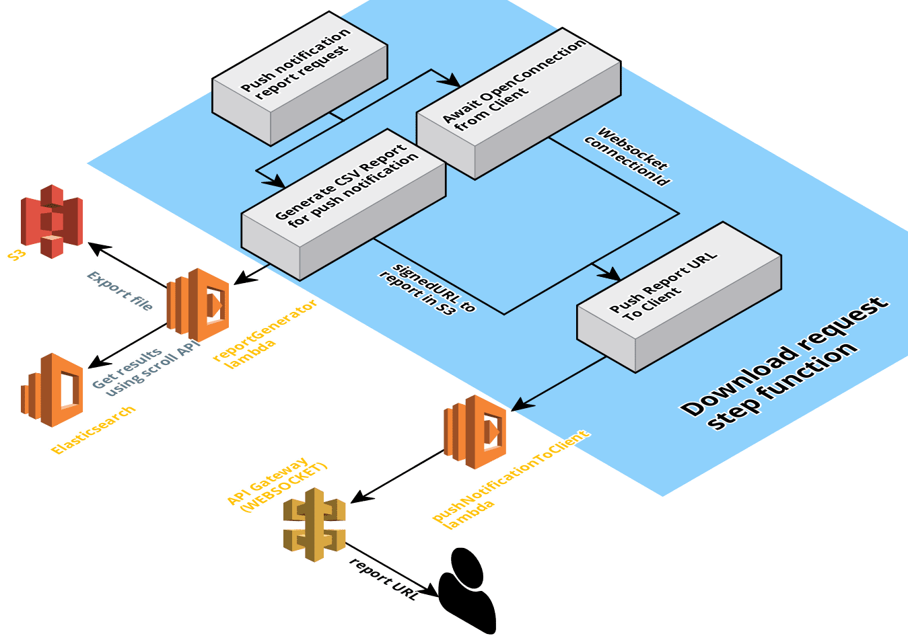

# search-data-exports-backend

Exploration of various large-scale data export techniques for browser-based users, using an AWS Serverless Lambda backend and an Elasticsearch datasource.

Exporting data via a web application, where large results sets are generated is a very common use case. Typically, the export process itself is asynchronous, due to the time taken to generate the data, either due to the large amount of data or time intensive processing against the data. This repository (and the related [frontend repository](https://github.com/ScottLogic/search-data-exports-frontend)) demonstrate worked examples of a number of techniques for achieving this. 

## Twitter Clone

To provide a dataset to help us explore this topic, a very basic Twitter clone has been created. The application is pretty simple for our purposes. The functionality required:

* Perform a text search against a data source
* Display the search results in a paginated form
* Allow the user to generate an export CSV file for the entire result set in a number of ways:
  * Download the export file, polling to see if the generation is complete
  * An email notification is sent to the user with a download link when the export file generation is complete
  * Download the export file, with a push notification via websockets when the generation is complete    

At a high level, the application looks like this:


## AWS Infrastructure

To build the necessary infrastructure we utilise two "infrastructure as code" services, namely:

* Terraform
* Serverless Framework

We used Terraform for the more static parts of the infrastructure, whereas the Serverless framework was used for the more dynamic infrastructure, that are changed often, such as Lambda's, Step Functions.

Terraform is used to create the following AWS services:

* Elasticsearch cluster
* S3 buckets

The Servlerless framework is used to create the more dynamic AWS services, related to our actual code:

* Lambda's
* Step Functions
* API Gateway (HTTP and Websocket)
* Cognito authentication

### Elasticsearch

A `t2.small.elasticsearch` cluster is created with a single index called posts. The posts index contains the following fields to support our Twitter clone posts:

* UserId - the id of the user who posted
* DateCreated - when the post was created
* Content - the actual post
* Tags - any hashtags associated with the post

#### Data Helix

We utilise an existing Scott Logic tool called [Data Helix](https://github.com/finos/datahelix), which generates test and simulation data, to populate our Elasticsearch index with meaningful data.

Data Helix generates skeleton test data and which we then enhance using randon strings to represent post context and tags. The resultant CSV file is then converted into JSON and imported into Elasticsearch. The project files for this can be found in:

* [Data import](dataimport)

### S3 Buckets

Two buckets are created:

* Public website bucket to host the [React frontend app](https://github.com/ScottLogic/search-data-exports-frontend)
* Private bucket to temporarily store the data export CSV files.
** Files in this bucket are all private and we return signed URL's to the user for each export
** The bucket has a lifecycle rule, which automatically expires files after a day to ensure the bucket isn't continuously growing in size
    
## Frontend

The [frontend](https://github.com/ScottLogic/search-data-exports-frontend) is written using React / Redux and utilises the AWS Amplify library, which allows us to leverage the AWS Cognito authentication service, giving us a login page and signup page for free. 

Once the user has logged in, a text box is displayed allowing the user to search the posts in the Elasticsearch cluster. A paginated list of matching searches is displayed to the user, and an "Export Results" button is enabled if there are matching results. On clicking the button, the following options are available:


Each of the export options will be explored in the following section.

## Export Results

There is a single API called `/download-request` which is called for all three types of download. The payload consists of the download type and the origin search criteria

~~~json
{
  "type":"direct",
  "searchCriteria":{
    ...
  }
}
~~~

The `type` field can be one of following:

* `direct`
* `email`
* `push`

Given the data export is an asynchronous request, the response is an `executionArn` which the frontend can use to determine if the download is complete, depending on the export type selected.

### The Download Request Lambda

The `/download-request` API in API Gateway calls the `downloadRequest` Lambda, which in turn starts the execution of an AWS Step Function to handle the 3 different download request types:


The Lambda then returns the `executionArn` of the Step Function, which then executes asynchronously.

### The download-request Step Function

The Step Function has 3 alternative paths, depending on the value contained in `type`.

~~~json
{
  "Choose download type": {
    "Type": "Choice",
      "Choices": [
      {
        "Variable": "$.type",
        "StringEquals": "email",
        "Next": "Email report request"
      },
      {
        "Variable": "$.type",
        "StringEquals": "direct",
        "Next": "Direct download of report"
      },
      {
        "Variable": "$.type",
        "StringEquals": "push",
        "Next": "Push notification report request"
      }
    ]
  }
}
~~~


### Direct download

When the `type=direct`, the `Direct download of report` choice is selected in the Step Function.


Whilst the report is generating, the frontend will poll the backend using the `executionArn` returned from the downloadRequest Lambda. Once complete, the signed URL for the generated report will be returned to the frontend:


### Email report
When the `type=email`, the `Email report request` choice is selected in the Step Function. The same Lambda is called to generate the report, but the signed URL output of the report generation is passed into the `Email CSV Report link to user` step. 

The email step uses the authenticated users email passed from the initial `/download-request` via a JWT, generates an email with the signed URL as the email body, and sends an email to the user via AWS Simple Email Services


### Push Notification report
When the `type=push`, the `Push notification report request` choice is selected in the Step Function. For this notification type, rather than the frontend polling the backend for the report generation completion, the backend will send a notification to the frontend using websockets.

We make use of an AWS Step Function Activity, to handle the frontend connecting to a websocket via API Gateway. For the example, the Activity is called AwaitOpenConnectionFromClient.

For a push notification, we return a `taskToken` for the `AwaitOpenConnectionFromClient` activity as well as the `executionArn` during the initial `/download-request`:


The frontend then connects to a websocket using API Gateway, passing the `executionArn` and `taskToken`. API Gateway, triggers a lambda called `pushNotificationOpenConnection` on an `OpenConnection` event on the API Gateway (WEBSOCKET), and this Lambda marks the `AwaitOpenConnectionFromClient` as complete and passes in the `connectionId` into the step. 


The `Await OpenConnection from Client` step will complete, once the frontend opens a websocket connection, and once the parallel task `Generate CSV Report for push notification` step is complete, the backend pushes the report URL via the websocket the frontend opened via a Lambda.


### Notes - 23/08/2019

The serverless dev dependency has been locked at version 1.49.0 as the latest version (1.50.0) currently causes the following error output:
```
Serverless: Installing dependencies for custom CloudFormation resources...
EMFILE: too many open files ...
```
Until a patch is released for the Serverless Framework the version will remain fixed at 1.49.0
