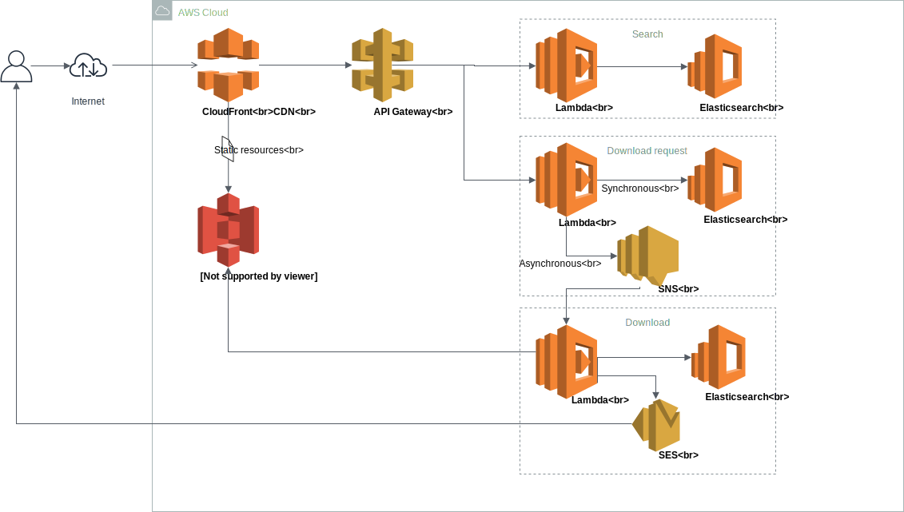

# Search Data Export

## AWS Infrastructure diagram


## Setting up the remote backend
To prevent conflicts with each other and avoid having to share the terraform state file,
we have added a Terraform remote backend. On each Terraform run, the state is retrieved and stored
in an AWS S3 bucket.

To setup the remote backend, follow [these instructions](./terraform-s3-backend-setup.md).

##Environment Variables
### Credentials
Set the AWS credentials for the SDE-Terraform user as we don't want these hard coded:
```
set AWS_ACCESS_KEY_ID=XYZ
set AWS_SECRET_ACCESS_KEY=abcdefghijklmnopqrstuvwxyz
```

Alternatively, other options are available:
* [Terraform AWS Authentication](https://www.terraform.io/docs/providers/aws/index.html)

## First time initialisation
```
terraform init
```

## Terraform Commands
### Create / update infrastructure
```
terraform apply
```

Where an alternative config is supplied:
```
terraform apply -var-file="uat.tfvars"
```
This applies to destroy and output commands.

### Destroy infrastructure
```
terraform destroy
```

### Output current settings
```
terraform output
```

## Configuration
The file [terraform.tfvars](tarraform.tfvars) contains the variables used by the configuration which builds the infrastructure in AWS. This file is loaded by default unless an alternative is supplied.  

An example is:
```hcl-terraform
project                = "sde"
environment            = "dev"
region                 = "eu-west-1"
```

### Configuration items
The items are:
* project
    * The name of the project, e.g. sde
* environment
    * The name of the environment we're creating, i.e prod, uat, dev etc.
* region
    * The AWS region name

## Deploying Lambdas
At the moment, for each lambda resource defined, terraform will look for the root level lambda package that matches
the provided lambda resource name. e.g. for the lambda with name `search`, it will search for the `./search-api` directory,
archive its contents in a zip, and use that to deploy to AWS.

We should therefore take care to name our lambda directory in the specified format `{$lambda-name}-api`, and run `npm install`
to install the `node_modules` before running terraform.